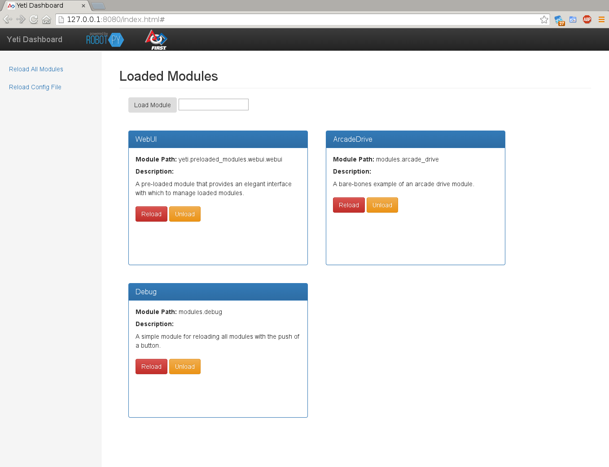

Getting Started
===============

What is yeti?
-------------

Yeti is a Python runtime framework designed for use on FIRST Robotics Competition Robots.
Yeti effectively isolates the robot-specific python code of your robot into "Modules" --
independent python files dynamically loaded at run-time. Modules can be freely loaded,
unloaded, replaced, and modified at any time. This allows you to easily build structured
robot programs, with mechanisms to promote rapid development and in-game failure recovery.

.. note:: This guide assumes some familiarity with RobotPy and python in general.

          If this is the first you have heard of RobotPy, you can read about it here:
          `About RobotPy <http://robotpy.github.io/about/>`_

.. note:: Yeti heavily utilizes asyncio, which is an asynchronous library that comes default
          with python. Some knowledge of asyncio would definitely be helpful, but not entirely
          necessary for this guide.

          You can read more about asyncio here: `Asyncio Documentation <https://docs.python.org/3.4/library/asyncio.html>`_

Installing Yeti
---------------

Yeti can be installed with pip, or with the robotpy installer.

With the robotpy installer
::

   #Connected to internet
   python3 installer.py download yeti

   #Connected to RoboRIO
   python3 installer.py install yeti

Or with pip
::

   pip install yeti

Using Yeti
----------

Yeti comes with a standard implementation of wpilib.IterativeRobot, which uses the default
configuration for yeti. You can quickly get started by pluging it into wpilib.run.

.. literalinclude:: ../../examples/basic_example/robot.py

.. note:: Advanced users may be interested in building their own Robot implementation to use yeti.
          You can read about how yeti works from the perspective of IterativeRobot in Building a Robot Implementation

Building Modules
----------------

A Basic Example
^^^^^^^^^^^^^^^

Here is a basic example for a drivetrain module. It contains all of the code required for reading values from joysticks, and driving a two-motor chassis.

.. literalinclude:: ../../examples/basic_example/modules/arcade_drive.py

.. .. note:: Here is where asyncio comes to play. You will nearly always want to import asyncio when creating
          Modules, you will see why later on.

The Module Object
^^^^^^^^^^^^^^^^^
The module itself is a class inheriting from the base module type: :class:`yeti.module`.

module_init
^^^^^^^^^^^
This is called upon module startup. Here is where you should initialize all of your wpilib refrences, get
interfaces squared away, and just get everything woken up.

::

     def module_init(self):
        #Initialize the Referee for the module.
        self.referee = Referee(self)

        #Setup a joystick
        self.joystick = wpilib.Joystick(0)
        self.referee.watch(self.joystick)

        #Setup the robotdrive
        self.robotdrive = wpilib.RobotDrive(0, 1)
        self.referee.watch(self.robotdrive)

.. note:: Notice the :class:`Referee` object we initialize here. The referee is a little utility class who's job is to
          ensure that wpilib objects get cleanly deallocated should your module get unloaded. Make it a habit to have
          a referee :meth:`Referee.watch()` any wpilib objects you have created.

coroutines
^^^^^^^^^^
.. note:: In breif, asyncio coroutines are fake threads. They have their own train of execution, deferring control
          whenever they "yeild from" something. To initialize a coroutine, use the "@asyncio.coroutine" decorator,
          as seen below. For more information, read the "Asyncio Documentation"

Here is the run loop used in the above module example:

::

    @gamemode.teleop_task
    @asyncio.coroutine
    def drive_loop(self):

        #Loop until end of teleop mode.
        while gamemode.is_teleop():

            #Get the joystick values and drive the motors.
            self.robotdrive.arcadeDrive(-self.joystick.getY(), -self.joystick.getX())

            #Pause for a moment to let the rest of the code run.
            yield from asyncio.sleep(.05)

The :meth:`gamemode.teleop_task` decorator causes the coroutine to be automatically run whenever
the robot is in teleoperated mode. When that happens, we use a while loop to continually iterate
while the robot remains in teleoperated mode. For each iteration we use the joystick inputs to set
the RobotDrive values. Before we loop back, we sleep for .05 of a second to let the rest of the robot
program run.

.. note:: "yield from" is used to transition from one coroutine's execution to another.
          "gamemode.wait_for_teleop()" Is a coroutine, supplied by the gamemode interface,
          which will pause execution in this "fake thread" until the robot is put into
          teleoperated mode. When this finishes, execution will return to our coroutine.

.. note:: Rather than using python's native time.sleep(), or wpilib's Timer.delay(), always
          use asyncio.sleep(), which allows other coroutines to execute.

Aside from using the decorators provided in :mod:`gamemode`, there are a few other ways to run module coroutines:

* By calling "yield from my_coroutine()" from another coroutine. Note that this is a synchronous process.
* Using the "self.start_coroutine(my_coroutine())" method. This schedules the coroutine, and returns immediately.
* Using the "yeti.autorun_coroutine()" decorator. This will cause the coroutine to run on module init.

Error Recovery
^^^^^^^^^^^^^^
One of the key features of yeti's modular system is how it handles module failure. When using instances of
ModuleLoader (Default in YetiRobot) you can specify what are called "module fallbacks". If any uncaught
exception is thrown from within a module, the offending module is immediately unloaded.

However, if that module is referenced in a fallback list, the next entry on the list is immediately loaded in it's
place. The reasoning behind this is to allow you to build, say, an "AwesomeDrive" module, with all of the fancy
functionality possible. But if this were to fail, you could have a "BasicDrive" ready to take its place -- allowing
your robot to cleanly recover from what would have been match-stopping errors.

Config File
-----------

The default YetiRobot uses the ConfigManager utility to define modules to run at start-up, as well
as fallback lists for modules.

Syntax
^^^^^^

Sections are defined by square brackets, as seen in the example. Other than the StartupMods section,
each section defines a fallback list. For example, see the drivetrain section in the example config
file shown below. It specifies two modules for the fallback list, the one found in modules/awesome_drive.py,
and the one found in modules/basic_drive.py. With this setup, whenever you want to load a drivetrain module,
you can now tell yeti to load "drivetrain" and it will grab the first entry on this list.

The StartupMods section is special. Rather than defining a fallback list, it lists modules to load upon program
startup.

::

    [StartupMods]
    drivetrain
    elevator
    modules.autonomous

    [drivetrain]
    modules.awesome_drive
    modules.basic_drive

    [elevator]
    modules.simple_elevator
    modules.pid_elevator

    #This is a comment

YetiRobot expects this file to be found at "mods.conf" in the same directory as robotpy.

Yeti WebUI
----------
Yeti comes preinstalled with a convenient WebUI, where you can control what is
going on with loaded modules. From here you can load, unload, and reload any module
with the click of a button.

To run the webui, set "yeti.preloaded_modules.webui" to load from your module
config file. The http server will start up on port 8080, and you should be able
to reach it at <computer_ip>:8080/index.html .

.. toctree::
    :hidden:

    building_robot_file